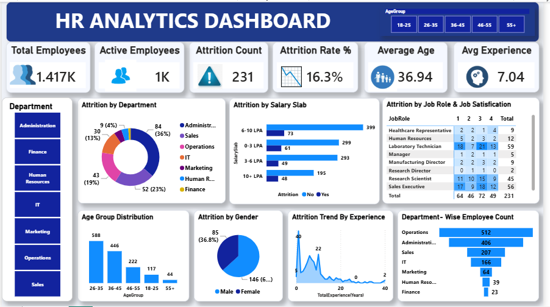

# 📊 HR Analytics Dashboard – Power BI

## 📌 Project Overview

This project is an interactive HR Analytics Dashboard created using Power BI.

The dashboard helps analyze employee data, attrition, departments, age groups, salary slabs, job roles, gender and employee experience.

## 🛠️ Tools & Technologies

- Power BI
- Power Query
- DAX
- Excel / CSV

## 📈 Dashboard Features

- Total Employees
- Active Employees
- Attrition Count
- Attrition Rate %
- Average Age
- Average Experience
- Attrition by Department
- Attrition by Salary Slab
- Attrition by Job Role & Job Satisfaction
- Age Group Distribution
- Attrition by Gender
- Attrition Trend by Experience
- Department-wise Employee Count

## 🖼️ Dashboard Preview

## 📁 Project Files

- `HR_Analytics_Dashboard.pbix` – Power BI dashboard file
- `HR_Analytics_Dashboard.png` – Dashboard preview

## 👩‍💻 Author

**Aishwarya Bodakhe**
